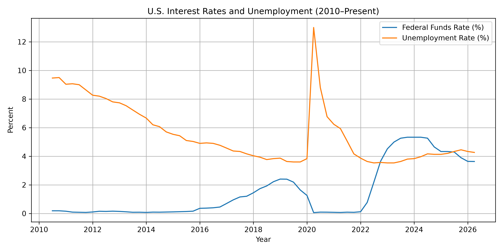
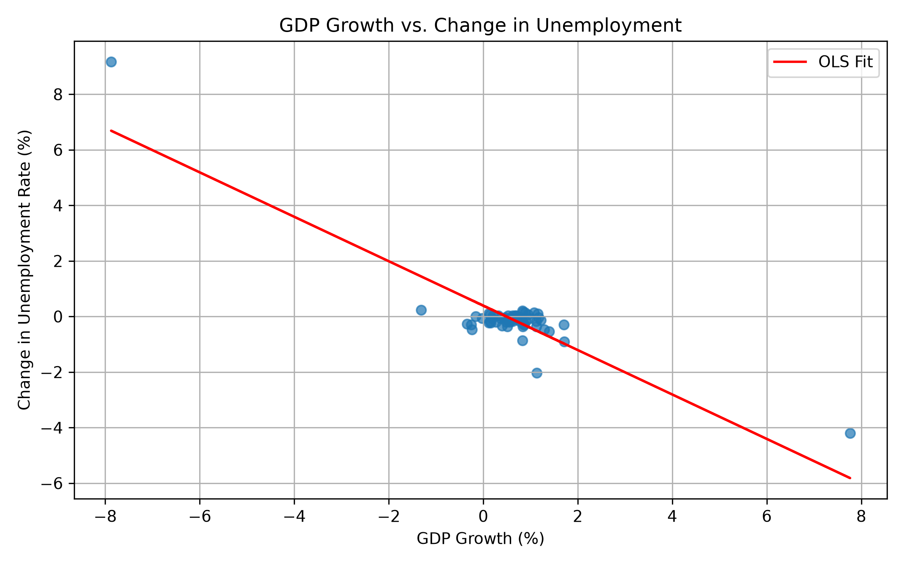
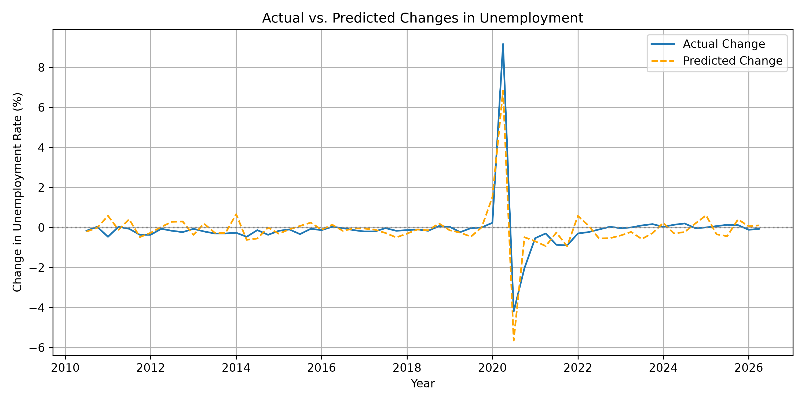

 Macroeconomic Analysis: Interest Rates, GDP, and Unemployment

 Overview
This project examines the relationship between U.S. interest rates, economic growth, and unemployment from 2010 through 2026. Using economic data from the Federal Reserve Economic Data (FRED) database, the project applies statistical analysis and ordinary least squares (OLS) regression to investigate how changes in monetary policy and GDP growth are associated with changes in unemployment.

The analysis also compares the relationship between these variables before and after the COVID-19 pandemic and examines whether changes in interest rates have a lagged relationship with unemployment.

---

 Visualizations

 1. Federal Funds Rate vs. Unemployment Rate


 2. Okun's Law: GDP Growth vs. Unemployment Rate Changes


 3. Model Performance: Actual vs. Predicted Unemployment Changes


---

 Research Questions
* How are changes in the Federal Funds Rate associated with changes in unemployment?
* How is GDP growth associated with changes in unemployment?
* Do changes in interest rates have a delayed relationship with unemployment?
* Did these relationships differ before and after the COVID-19 pandemic?

---

 Data
The project uses three FRED economic series:
* `FEDFUNDS` — Effective Federal Funds Rate
* `UNRATE` — U.S. Unemployment Rate
* `GDPC1` — Real Gross Domestic Product

---

 Setup & Installation

1. Install dependencies:
   ```bash
   pip install -r requirements.txt
